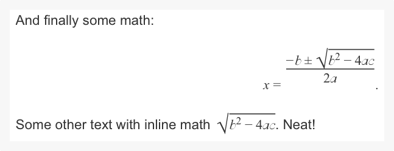

# Documark Math

Documark plugin for adding math formulas to your document.

## Usage

1. Add plugin to document configuration:

	```yaml
	plugins:
	  - documark-math
	```

2. This will inject the [MathJax JS libary][mathjax], so you can use it in your document:

	```jade
	p Here is a random math formula:

	//- Block:
	| $$x = {-b \pm \sqrt{b^2-4ac} \over 2a}.$$

	//- Inline:
	p Some other text with inline math %% \sqrt{b^2-4ac} %%. Neat!
	```

3. The output will look something like this:

	

	See the `Example.pdf` of the [Documark example][documark-example] for the final result.

[mathjax]: http://www.mathjax.org/
[documark-example]: https://github.com/mauvm/documark-example
